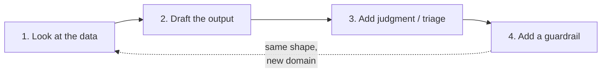

<p align="center">
  
</p>

# Automating Your Business Using Agents
### Save More, Earn More — a hands-on AI automation workshop

[](https://codespaces.new/soaldoAI/save-more-earn-more-workshop?quickstart=1)


A one-day, no-code-required workshop where small business owners and operators build three real AI agents by the end of the morning — not slides about AI, working automations wired to their own business tasks. Everything runs in the browser through GitHub Codespaces, driven by [Claude Code](https://claude.com/claude-code) in plain English.

---

## Contents

- [What this repo is](#what-this-repo-is)
- [Quick start](#quick-start)
- [What you'll build](#what-youll-build)
- [The pattern behind every build](#the-pattern-behind-every-build)
- [Repository structure](#repository-structure)
- [Today's agenda](#todays-agenda)
- [The one rule that matters: guardrails](#the-one-rule-that-matters-guardrails)
- [After the workshop](#after-the-workshop)
- [Requirements](#requirements)

---

## What this repo is

This is a **live workshop workspace**, not a demo you watch — every attendee opens their own copy of this repository as a GitHub Codespace and builds inside it. By the end of the session each person has:

- Three working agents (lead follow-up, invoice processing, review responses), tested against real sample data
- A fourth agent built from scratch against their own business data
- A written guardrail on every agent — the one rule it's never allowed to break
- A 90-day roadmap for turning today's prototypes into agents running on their real inbox, accounting tool, and review platform

No local setup, no installs, no prior coding experience required. If you can describe a task in a sentence, you can build the agent for it.

## Quick start

**For attendees:**

1. Click **Open in GitHub Codespaces** above (or the link on your seat card). Give it a minute to build.
2. Your `.env` file is created automatically. Open it, paste the API key from your seat card between the quotes, and save (`Cmd/Ctrl+S`).
3. In the terminal at the bottom of the screen, run:
   ```bash
   source .env
   ```
4. Start Claude Code:
   ```bash
   claude
   ```
   Say hello to confirm it's working, then open `README.md` in the file browser — it tells you exactly where to go next.

**Stay in one Claude Code session for the whole day.** Every prompt in every project's instructions already includes the full folder path (e.g. `project-1-email-followup/leads.csv`), so there's no need to restart or `cd` between exercises inside Claude Code itself.

## What you'll build

| | Project | Business problem | Skill practiced |
|---|---|---|---|
| **1** | [`project-1-email-followup/`](./project-1-email-followup) | Inbound leads sit unanswered for hours | Draft replies, triage by urgency, then ship the same agent live on Telegram |
| **2** | [`project-2-invoice-processing/`](./project-2-invoice-processing) | Invoices get paid without being checked against the PO | Match invoice to purchase order, catch price/quantity/missing-PO mismatches |
| **3** | [`project-3-customer-reviews/`](./project-3-customer-reviews) | Reviews go unanswered, or get a defensive reply that makes things worse | Tone-matched replies, plus flagging what needs a phone call instead of a public reply |
| **4** | [`project-4-your-own-task/`](./project-4-your-own-task) | Whatever's actually costing *you* time | Apply the same four-step shape to your own data |
| bonus | [`bonus-meeting-notes/`](./bonus-meeting-notes) | Meeting notes never turn into action | Same pattern, a different domain — try it if you finish early |

Each project folder is self-contained: sample data, a `CLAUDE.md` with that project's standing guardrail, and a `README.md` with the exact prompts to copy and paste, in order.

## The pattern behind every build

Every one of today's agents — and most real business automations — is the same four steps, aimed at a different problem each time:



| Step | What it means | Example (Build 2) |
|---|---|---|
| **1. Look at the data** | Read the raw input and describe it back in one line | "Summarize the invoices — how many, what's flagged" |
| **2. Draft the output** | Produce the first version of the real deliverable | Match each invoice to its PO |
| **3. Add judgment** | Ask it to make a call, not just report | Classify each as match / price mismatch / qty mismatch / no PO found |
| **4. Add a guardrail** | One rule it must never break, written once, applied every time | "Never recommend payment on any discrepancy, however small" |

Once you've done this once, you've done it for every business problem that follows the same shape — which is most of them.

## Repository structure

```
save-more-earn-more-workshop/
├── README.md                        ← you are here
├── .env.example                     ← copied to .env automatically on Codespace start
├── .devcontainer/                   ← Codespaces config (Claude Code pre-installed)
├── materials/
│   ├── 00-agenda.md                 ← today's run of show
│   ├── find-your-task-worksheet.md  ← "what's my $10K task" exercise
│   ├── 90-day-roadmap-worksheet.md  ← turning today's builds into production agents
│   └── bonus-build-a-ui.md          ← optional: turn any build into a one-click app
├── project-1-email-followup/        ← Joint Build 1
│   ├── CLAUDE.md                    ← this project's guardrail
│   ├── README.md                    ← step-by-step instructions
│   ├── TWO-AGENT-DEMO.md            ← optional stretch: a two-agent review workflow
│   └── leads.csv                    ← sample data
├── project-2-invoice-processing/    ← Joint Build 2
│   ├── CLAUDE.md
│   ├── README.md
│   ├── incoming-invoices.csv
│   └── purchase-orders.csv
├── project-3-customer-reviews/      ← Joint Build 3
│   ├── CLAUDE.md
│   ├── README.md
│   └── reviews.csv
├── project-4-your-own-task/         ← Personal build, your own data
│   └── README.md
└── bonus-meeting-notes/             ← optional fourth pattern
    ├── README.md
    └── meeting-transcript.txt
```

Every `CLAUDE.md` is read automatically by Claude Code the moment you're working inside that folder — it's how each project's guardrail stays active without you having to repeat it in every prompt.

## Today's agenda

| Time | Block |
|---|---|
| 9:30 – 9:50 | Welcome & why this matters |
| 9:50 – 10:25 | Find your $10K task |
| 10:25 – 10:35 | Environment check |
| 10:35 – 11:20 | Joint Build 1 — Email & lead follow-up (+ live on Telegram) |
| 11:20 – 11:50 | Joint Build 2 — Invoice processing (PO matching) |
| 11:50 – 12:00 | Break |
| 12:00 – 12:30 | Joint Build 3 — Customer review response agent |
| 12:30 – 1:00 | Personal build — your own task |
| 1:00 – 1:10 | Guardrails & quick showcase |
| 1:10 – 1:35 | 90-day roadmap |
| 1:35 – 2:00 | Next steps |

Everything you build today stays in your Codespace — download it before you leave, or push it to your own GitHub repo to keep working on it tonight.

## The one rule that matters: guardrails

Capability without a boundary isn't useful — it's a liability. Every build today ends the same way: once the agent works, we add one rule it must never break on its own —

- Never promise a price or a fix in writing.
- Never recommend payment when anything doesn't match, however small the difference.
- Never admit fault in a public reply.

That rule lives in the project's `CLAUDE.md`, gets picked up automatically, and applies to every prompt from then on. The question to ask after every build you ever make, starting today: **what's the one thing this must never do on its own?**

## After the workshop

The `materials/90-day-roadmap-worksheet.md` walks through turning today's prototypes — which read from sample CSV files — into agents connected to your real inbox, accounting software, or review platform, using [MCP](https://modelcontextprotocol.io) (Model Context Protocol), the standard way an agent connects to outside tools. Same agent, same guardrail, real data.

## Requirements

- A GitHub account (Codespaces runs entirely in the browser — nothing to install locally)
- The Anthropic API key on your seat card
- Curiosity, and a real task you'd like automated

---

<p align="center"><sub>EDGEGENIX AI · SAVE MORE, EARN MORE</sub></p>
